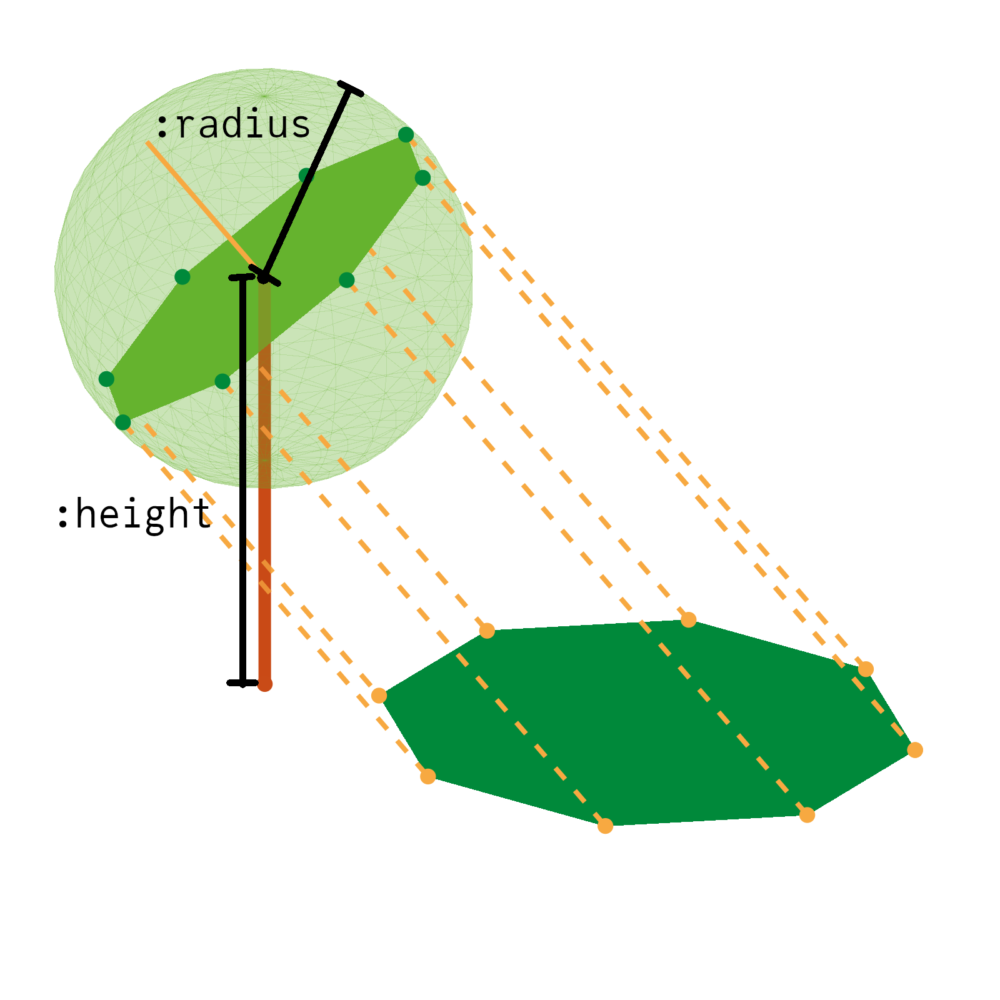

# Shadow Casting
## Introduction
For trees, we assume their crown to be circular/spherical (approxiated by an octagon) with radius `:radius`,
whose normal is pointed towards the sun, centered at `:height` above the ground. This object is projected onto
the plane to give the final shadow.



## API

```@index
Pages = ["ShadowCasting.md"]
```

```@autodocs
Modules = [TreeLoaders]
Pages = ["ShadowCasting.jl"]
```